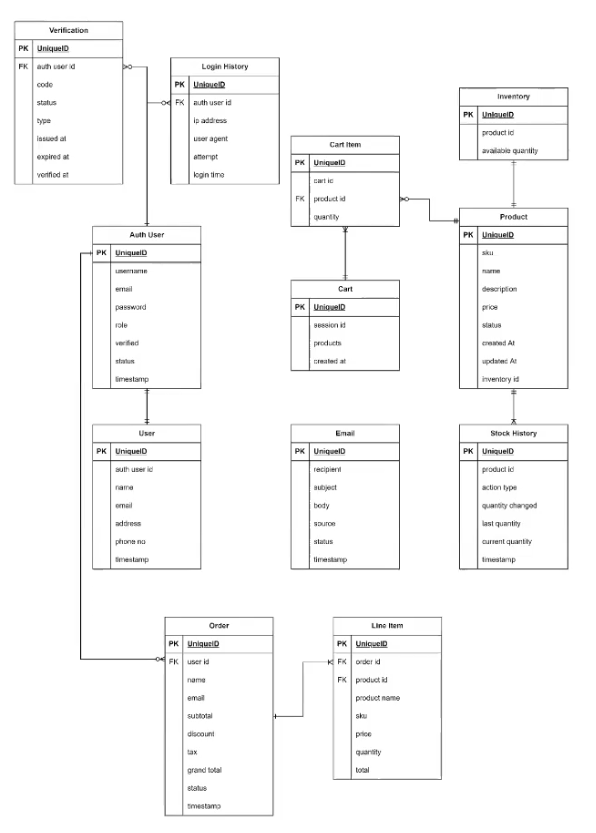

# MR Beast E-commerce Microservice Project

This project focuses on exploring and implementing high-traffic microservices. It draws inspiration from Mr. Beast's ability to handle massive traffic, especially in an e-commerce environment. The project emphasizes traffic management, caching, and scalability, aiming to ensure seamless and efficient service operation under heavy load.

## Table of Contents

1. [Project Overview](#project-overview)
2. [Features](#features)
3. [Architecture](#architecture)
4. [Technologies Used](#technologies-used)
5. [Microservices](#microservices)
6. [Traffic Handling & Caching](#traffic-handling--caching)
7. [Setup and Deployment](#setup-and-deployment)
8. [Testing](#testing)
9. [Future Enhancements](#future-enhancements)
10. [Contributing](#contributing)
11. [License](#license)
12. [ER Diagram](#er-diagram)

---

## Project Overview

**MR Beast E-commerce** is an experimental microservice project designed to handle high traffic with advanced caching and load management. The main goal of the project is to showcase an optimized microservice infrastructure that can serve an e-commerce platform under heavy traffic conditions, as might be experienced by popular e-commerce websites or large-scale events.

## Features

- **High Traffic Handling**: Focused on managing large amounts of requests and users simultaneously.
- **Caching Mechanism**: Caches essential data (like products, user sessions) to reduce database load and improve response times.
- **Efficient API Gateway**: Directs traffic to the appropriate microservices while balancing load.
- **Scalability**: Designed to scale horizontally to meet increasing traffic demands.
- **Robust Authentication**: Secure login and registration functionality with JWT-based authentication.
- **Order Processing**: Ensures reliable order placement and payment processing under high traffic.
- **Inventory Management**: Handles real-time updates for product availability and inventory tracking.
- **Data Consistency**: Ensures data is accurate and consistent across all microservices.
- **Asynchronous Processing**: Handles background tasks such as order confirmations and inventory updates.

## Architecture

The architecture follows a microservice design, where each service is independently deployable and responsible for a distinct domain within the e-commerce environment.

- **API Gateway**: Directs and manages traffic between users and services.
- **Caching Layer**: Reduces database load and optimizes response times.
- **Monitoring & Logging**: Captures system performance and health metrics.

## Technologies Used

- **Node.js / Express**: Backend services.
- **Docker**: Containerization for isolated, consistent environments.
- **Redis**: In-memory caching layer for fast data retrieval.
- **PostgresSQL**: Database systems for different services.
- **Nginx**: Load balancing and request routing.
- **Kong API Gateway**: Manages service requests and API security.
- **keycloak**: for Authentication and IAM
- **GitHub Actions**: CI/CD pipelines for continuous integration and delivery.

## Microservices

1. **Authentication Service**: Secure user authentication using JWTs.
2. **User service**: User service
3. **Product Service**: Manages product listings, search, and categorization.
4. **Cart Service**: Handles user cart operations, including item additions, removals, and persistency.
5. **Order Service**: Manages order creation, status updates, and payments.
6. **Inventory Service**: Tracks and updates real-time inventory levels.
7. **Email Service**: Sends real-time Email for orders and important events.
8. **Message Broker**: Utilizes RabbitMQ for managing asynchronous communication between microservices.

## Traffic Handling & Caching

To ensure the platform remains responsive during traffic surges:

- **Redis Caching**: Frequently accessed data like product listings and user session information are stored in Redis to minimize database queries.
- **Load Balancing**: Nginx distributes traffic across different service instances to prevent overloading a single service.
- **Rate Limiting**: API gateway enforces rate limiting to control the number of requests each user can make, preventing abuse and DDoS attacks.
- **Asynchronous Tasks**: RabbitMQ is used for asynchronous processing of background tasks such as order confirmations, inventory updates, and other inter-service communications, ensuring the user-facing services remain responsive.

## Setup and Deployment

### Prerequisites

- Docker

### Steps

1. Clone the repository:

   ```bash
   git clone https://github.com/ibrahimsifat/micro-service-ecommerce.git
   ```

2. Build and run the Docker containers:
   ```bash
   docker-compose up
   ```
3. Run Kong and necessary service

   ```bash
   cd kong-docker-compose && docker compose -f ./kong-docker-compose.yml up
   ```

4. Run keycloak
   ```bash
   cd docker keycloak-docker-compose && docker compose -f ./keycloak-docker-compose.yml up
   ```
5. Access the application via the API Gateway at `http://localhost:8000`.
6. The microservices will be available at their respective endpoints through the gateway.

## License

This project is licensed under the MIT License. See the [LICENSE](LICENSE) file for more details.

## ER Diagram


